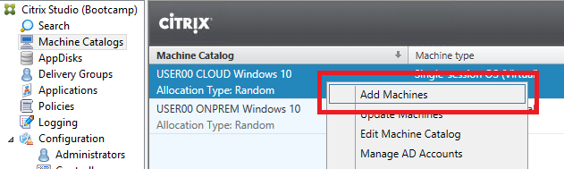

.. _euc_runbook:

------------------------------------
Dynamic Expansion with Calm Runbooks
------------------------------------

.. note::

   This exercise depends on prior completion of the **Hybrid Cloud IaaS** :ref:`snow_preparingenv` exercise to define your user specific Calm project. Refer to the linked section first before proceeding.

The normal procedure for expanding Machine Catalogs is only a few clicks within **Desktop Studio** - and as seen in the previous exercise, spinning up new Citrix desktops on AHV is very fast.

However, if you have a team managing multiple networks, with new requests for desktops every day (or potentially self-service requests from end users), it could be advantageous to automate adding desktops across clusters dynamically based on some policy.

Unlike Calm Blueprints, which provision new VMs, Calm Runbooks provide a means of visually defining and executing a string of actions that can be run against existing VMs and web services. For instance, you could create a Calm Runbook to apply application updates across a group of VMs.

In this exercise, you will build a Calm Runbook to dynamically add a new Citrix desktop to either your on-prem or Clusters hosted Nutanix cluster, based on memory utilization.

Defining Endpoints
++++++++++++++++++

Within Calm, Runbooks and the tasks they execute are assigned to/associated with Endpoints. Think of an Endpoint as an IP address or host on which the task will run. Within the Calm UI, each Endpoint is configured with IP/DNS address and credentials.

In total, to automate your **Add Desktop** function, your Runbook will need to connect to each of your two clusters and your Citrix DDC VM.

#. In **Prism Central**, select :fa:`bars` **> Services > Calm**.

#. Select the **Endpoints** icon from the lefthand toolbar and click **+ Create Endpoint**.

   .. figure:: images/4.png

#. Fill out the following fields:

   - **Name** - USER\ *##* AWS PE VIP
   - **Project** - USER\ *##*\ -Project
   - **Type** - HTTP
   - **Base URL** - \https://*YOUR-AWS-CLUSTER-PRISM-VIP*\ :9440 (ex. https://10.210.X.X:9440)
   - **Authentication > Type** - Basic
   - **Username** - admin
   - **Password** - Refer to your :ref:`clusterassignments`

   .. figure:: images/5.png

# Click **Save**.

#. Repeat **Step 2** to add an endpoint for **USER**\ *##* **HPOC PE VIP**:

   - **Name** - USER\ *##* HPOC PE VIP
   - **Project** - USER\ *##*\ -Project
   - **Type** - HTTP
   - **Base URL** - \https://*YOUR-HPOC-CLUSTER-PRISM-VIP*\ :9440 (ex. https://10.42.X.39:9440)
   - **Authentication > Type** - Basic
   - **Username** - admin
   - **Password** - Refer to your :ref:`clusterassignments`

#. Click **Save**.

#. Repeat **Step 2** to add an endpoint for your **Citrix DDC** VM:

   - **Name** - USER\ *##* DDC
   - **Project** - USER\ *##*\ -Project
   - **Type** - Windows
   - **IP Addresses** - ddc.ntnxlab.local
   - **Username** - NTNXLAB\\Administrator
   - **Password** - Refer to :ref:`clusterdetails`

#. Click **Save**.

   .. figure:: images/8.png

Defining Runbook Variables
++++++++++++++++++++++++++

Variables will allow you to define the names of your machine catalogs and delivery group within your Citrix environment. These values could be hard-coded into your tasks, but this approach allows for greater flexibility to run against different environments.

#. From the left-hand toolbar, select the **Runbooks** icon and click **+ Create Runbook**.

   .. figure:: images/1.png

#. Fill out the following fields:

   - **Name** - USER\ *##* Add Desktop (ex. USER01 Add Desktop)
   - **Project** - USER\ *##*\ -Project (ex. USER01-Project)
   - **Endpoint** - Leave Blank

   .. note::

      This exercise depends on prior completion of the **Hybrid Cloud IaaS** :ref:`create_project` exercise. Refer to the linked section first before proceeding.

#. Click **Proceed**.

#. Select **Configuration** from the upper toolbar to first define the variables you will use in your Runbook.

   .. figure:: images/2.png

#. Click **Add/Edit Variables > + Add Variable** and create the following variables:

   .. raw:: html

       <strong>The variable names and values are not case sensitive, but the runbook will fail if the Machine Catalog and Delivery Group values do not match the values in Citrix Studio. Watch out for typos and extra spaces!</strong> 

   - **Variable 1**

      - **Name** - DELIVERY_GROUP
      - **Data Type** - String
      - **Value** - *The name of your Delivery Group within Citrix Studio* (ex. USER01 Windows 10)

   - **Variable 2**

      - **Name** - CLOUD_MCATALOG
      - **Data Type** - String
      - **Value** - *The name of your Cloud Machine Catalog within Citrix Studio* (ex. USER01 CLOUD Windows 10)

   - **Variable 3**

      - **Name** - ONPREM_MCATALOG
      - **Data Type** - String
      - **Value** - *The name of your On-prem Machine Catalog within Citrix Studio* (ex. USER01 ONPREM Windows 10)

   - **Variable 4**

      - **Name** - TARGET_MCATALOG
      - **Data Type** - String
      - **Value** - *Leave Blank*

   .. figure:: images/3.png

   Variable 4 will be set via an EScript as part of the Runbook, but needs to be explicitly defined as a variable prior to runtime.

#. Click **Done**.

Building the Runbook
++++++++++++++++++++

Similar to the Calm Blueprint Editor, building a Runbook allows you to visually build the sequence of tasks with minimal coding.

#. Select **Editor** from the upper toolbar and click **+ Add Task**.

   Memory utilization data is provided via the Prism V2 API, meaning we will need to query each cluster's Prism Element API.

#. Fill out the following fields:

   - **Name** - Get AWS Mem Usage
   - **Type** - HTTP
   - **Endpoint** - USER\ *##* AWS PE VIP
   - **Request Method** - GET
   - **Relative URL** - /PrismGateway/services/rest/v2.0/cluster/
   - **Content Type** - JSON (application/JSON)
   - **Response Code** - 200
   - **Response Status** - SUCCESS
   - **Variable** - CLOUD_MEM_USAGE
   - **Path** - $.stats.hypervisor_memory_usage_ppm

   .. figure:: images/6.png

#. Click **Save**.

   .. note::

      Before proceeding to the next Task, you can validate your API functions properly by clicking **Test Request > Test**.

      The **Output** response should include the variable you are attempting to set, as shown below.

      .. figure:: images/9.png

      The **hypervisor_memory_usage_ppm** datum provides the Cluster's memory utilization out of 1,000,000 (ex. 144369 = 14.4369%).

#. Click **Add Task** below your first task to add your next API call.

   .. figure:: images/10.png

   .. note::

      Runbooks also provide the ability to run tasks in parallel, as well as perform loops and branching logic.

#. Fill out the following fields:

   - **Name** - Get HPOC Mem Usage
   - **Type** - HTTP
   - **Endpoint** - USER\ *##* HPOC PE VIP
   - **Request Method** - GET
   - **Relative URL** - /PrismGateway/services/rest/v2.0/cluster/
   - **Content Type** - JSON (application/JSON)
   - **Response Code** - 200
   - **Response Status** - SUCCESS
   - **Variable** - ONPREM_MEM_USAGE
   - **Path** - $.stats.hypervisor_memory_usage_ppm

   Observe that the same call is being used against a different Endpoint, and saving the output to a different variable.

#. Click **Save** and optionally test your new request.

#. Click **Add Task** below **Get HPOC Mem Usage**.

   Now that you have both of your memory utilization figures from your clusters, it is time to decide which cluster is better suited for desktop provisioning.

   There are multiple ways to do this, including sending both variables to your **Citrix DDC** VM and to perform any logic as part of a PowerShell script - however, this is a great opportunity to try a simple Calm EScript!

   Calm provides a limited Python-based shell, referred to as `EScript <https://portal.nutanix.com/page/documents/details?targetId=Nutanix-Calm-Admin-Operations-Guide-v3_1_0:nuc-supported-escript-modules-functions-c.html>`_ to process local scripts, which could include operations such as accessing public cloud SDKs or setting Calm variable values.

#. Fill out the following fields:

   - **Name** - Choose Target Cluster
   - **Type** - Set Variable
   - **Script Type** EScript
   - **Endpoint** - *Leave Blank*
   - **Script** -

   .. code-block:: python

      # If on-prem cluster memory utilization > 20% OR cloud cluster memory utilization is < on-prem, provision new desktop to cloud cluster, otherwise, provision on-prem

      if "@@{ONPREM_MEM_USAGE}@@" > 200000 or "@@{CLOUD_MEM_USAGE}@@" < "@@{ONPREM_MEM_USAGE}@@" :
      	target = "@@{CLOUD_MCATALOG}@@"
      else :
      	target = "@@{ONPREM_MCATALOG}@@"

      print("TARGET_MCATALOG={}").format(target)

   - **Output** - TARGET_MCATALOG

   .. figure:: images/11.png

#. Click **Add Task** again to add your final task.

   This task will take the name of the chosen Machine Catalog most suitable for desktop provisioning, and insert it into a simple PowerShell script to run on your **Citrix DDC** to add another desktop to the Machine Catalog, and add it to the Delivery Catalog to make it available for use.

#. Fill out the following fields:

   - **Name** - Add Desktop
   - **Type** - Execute
   - **Script Type** - Powershell
   - **Endpoint** - USER\ *##* DDC
   - **Credential** - *Leave blank, as this is configured within your Endpoint*
   - **Script** -

   .. code-block:: powershell

      $catalogName = "@@{TARGET_MCATALOG}@@"
      $deliveryGroup = "@@{DELIVERY_GROUP}@@"

      # Create new machine account in AD
      $identityPool = Get-AcctIdentityPool -IdentityPoolName $catalogName
      $identityPool.IdentityPoolUid
      $newADAccount = New-AcctADAccount -Count 1 -IdentityPoolUid $identityPool.IdentityPoolUid
      $newADAccount

      # Provision VM
      $provVM = New-ProvVM -ADAccountName @($newADAccount.SuccessfulAccounts[0].ADAccountName) -ProvisioningSchemeName $catalogName
      $provVM

      # Add VM to Machine Catalog
      Lock-ProvVM -ProvisioningSchemeName $catalogName -Tag "Brokered" -VMID @($provVM.CreatedVirtualMachines[0].VMId)
      $brokerCatalog = Get-BrokerCatalog -Name $catalogName
      $brokerCatalog
      $brokerMachine = New-BrokerMachine -CatalogUid $brokerCatalog.Uid -MachineName $provVM.CreatedVirtualMachines[0].ADAccountSid

      # Clean up provisioning task from DB because you care about the environment
      Remove-ProvTask -TaskId $provVM.TaskId

      # Add VM to Delivery Group
      Add-BrokerMachine -DesktopGroup $deliveryGroup -InputObject $brokerMachine

#. Click **Save**.

   If you're interested in learning more about automating tasks in Citrix Studio via Powershell, the Citrix Studio client makes it easy to get started. The client essentially acts as a front-end for Powershell commands.

   You can open Studio, perform some task (ex. updating a machine catalog) and then access the Powershell tab as shown in the screenshot to view all of the commands that were issued to implement the action you performed via the GUI.

   .. figure:: images/14.png

Testing Your Runbook
++++++++++++++++++++

#. From the upper toolbar, click **Execute**.

#. Leave the default **Endpoint** selection blank, and click **Execute**.

#. You can monitor the status of the Runbook on the **Audit** tab.

   .. note::

      If you encounter an error, review the **Output** and return to **Edit this Runbook**. In the example below, the Endpoint was misconfigured to point to **Prism Central** and not **Prism Element** resulting in an incorrect API response.

      .. figure:: images/12.png

      Also verify your variable values for **ONPREM_MCATALOG**, **CLOUD_MCATALOG**, and **DELIVERY_GROUP** match the names in Citrix Studio.

#. If properly configured, the Runbook should complete successfully in a matter of seconds.

   .. figure:: images/13.png

   Similar to Calm, you can select individual stages to view the script output.

   .. figure:: images/16.png

#. You can validate your success by returning to **Citrix Studio** and looking at either your Delivery Group or Machine Catalogs to confirm a new VM has been provisioned.

   .. figure:: images/15.png

   In an upcoming version of Nutanix Calm, you will be able to publish Runbooks to the Calm Marketplace, allowing you to use a version of this Runbook to allow users to perform self-service requests for a virtual desktop.

   Or you could fully automate the process to grow and shrink your machine catalogs based on utilization by `launching Runbooks via API <https://www.nutanix.dev/2020/06/12/nutanix-calm-runbooks-api-automation/>`_.

Takeaways
+++++++++

- Runbooks are another means of automated application and datacenter operations within a Nutanix environment

- By running the same Nutanix AHV/AOS stack on public cloud servers as on-premises, applying these automations is little different than managing multiple clusters within your own datacenter
