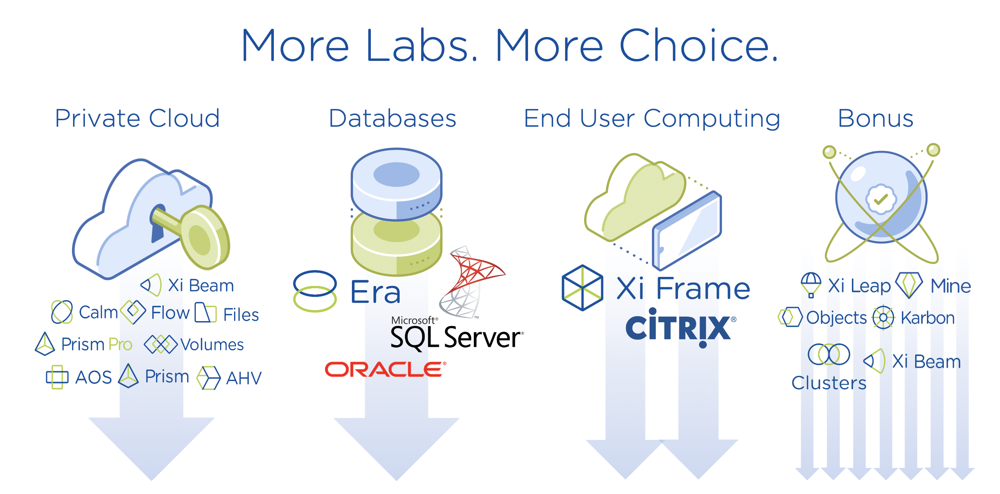

.. title:: Nutanix Global Tech Summit 2020

.. toctree::
   :maxdepth: 2
   :caption: Event Info
   :name: _info
   :hidden:

   info/clusterinfoprod
   info/clusteraccess
   info/emeahelp

.. toctree::
   :maxdepth: 2
   :caption: Private Cloud
   :name: _privatecloud
   :hidden:

   pc/dayinlife/dayinlife
   prismops/prismops_capacity_lab/prismops_capacity_lab
   prismops/prismops_rightsize_lab/prismops_rightsize_lab
   pc/security/security
   pc/files/files
   pc/flow_secure_fiesta/flow_secure_fiesta
   beam_cost_governance/beam_cost_governance
   pc/cleanup/cleanup

.. toctree::
   :maxdepth: 2
   :caption: Databases
   :name: _dbs
   :hidden:

   db/gettingstarted/gettingstarted
   db/mssqldeploy/mssqldeploy
   db/cloning/cloning
   db/aag/aag
   db/oraclepatch/oraclepatch
   db/flow_secure_fiesta/flow_secure_fiesta
   db/flow_isolate_fiesta/flow_isolate_fiesta
   prismops/prismops_blue_medora_lab/prismops_blue_medora_lab
   db/cleanup/cleanup

.. toctree::
   :maxdepth: 2
   :caption: End User Computing - Xi Frame
   :name: _eucframe
   :hidden:

   eucframe/gettingstarted/gettingstarted
   eucframe/move/move
   eucframe/goldimage/goldimage
   eucframe/deploycca/deploycca
   eucframe/manage/manage
   eucframe/framefiles/framefiles
   eucframe/flow_secure_desktops/flow_secure_desktops
   prismops/prismops_rightsize_frm_lab/prismops_rightsize_euc_lab
   eucframe/cleanup/cleanup

.. toctree::
   :maxdepth: 2
   :caption: End User Computing - Citrix
   :name: _euccitrix
   :hidden:

   euccitrix/gettingstarted/gettingstarted
   euccitrix/move/move
   euccitrix/goldimage/goldimage
   euccitrix/pdesktops/pdesktops
   euccitrix/npdesktops/npdesktops
   euccitrix/updatecatalog/updatecatalog
   euccitrix/files/files
   euccitrix/flow_quarantine_vm/flow_quarantine_vm
   euccitrix/flow_secure_desktops/flow_secure_desktops
   prismops/prismops_rightsize_ctx_lab/prismops_rightsize_euc_lab
   euccitrix/cleanup/cleanup

.. toctree::
   :maxdepth: 2
   :caption: Bonus Labs
   :name: _bonus
   :hidden:

   beam_security_compliance/beam_security_compliance
   calm_karbon_cicd/calm_karbon_cicd
   onpremleap/onpremleap
   splunkobjectslab/splunkobjectslab
   mine/hycu/hycu/hycu
   peer/peer
   mine/veeam/veeam

.. /mine/hycu/protecting-physical/protectingphysical

.. raw:: html

   

 

**Welcome!** This year we're celebrating how we power customer use cases by exposing you to multiple new options that will be launched as Bootcamps for you to drive prospect and customer engagement during 2020. During this year's Hands on Learning day, you'll choose and complete **at least** one of four available solution-focused lab tracks.

.. raw:: html

   <strong>Review the descriptions of the lab tracks below before choosing and starting a track. You may choose any track, or work on multiple tracks simultanesouly. The Private Cloud track is highly suggested for SEs who have been with Nutanix less than 6 months. Once you begin a track, make sure to complete the labs within the track IN ORDER, as some exercises may be dependent on work completed in the previous exercise. Bonus labs may be completed at any time.</strong>

**Private Cloud Track** - *The Private Cloud labs are highly recommended for all attendees who have been with Nutanix for less than 12 months. This track will dive into common Day 2 administrator and operator workflows, exposing the facets of Nutanix that make it ideal as a Private Cloud foundation for any organization. In these labs you will work with and learn about the core platform, AHV, Prism Pro, Files, Calm, Flow, and more.*

**Databases Track** - *The databases track is ideal for users looking to become more familiar with the benefits the core Nutanix platform, Era, Flow, and Prism Pro can deliver for an organizations most business critical workloads, including Microsoft SQL Server and Oracle.*

**End User Computing (Xi Frame)** - *The EUX Xi Frame track walks you through an end to end deployment of Xi Frame on AHV, including gold image creation, desktop management, Files integration,  securing desktops with Flow, and more.*

**End User Computing (Citrix)** - *The EUC Citrix track provides a pre-deployed Citrix Delivery Controller, and walks you through integration with AHV, golden image creation, desktop management, Files integration with user profiles, securing desktops with Flow, and more.*

**Bonus Labs** - *There are a number of standalone labs that can be completed independent of your chosen lab track. These labs can be completed at any time. There are periods of time during the solution lab tracks where you may be provisioning an application, database, etc. where you will have 15 minutes or more that can be spent working on Bonus labs, or labs from an alternate solution track.*

.. raw:: html

  <strong>Before beginning any labs, review the following sections for important information regarding your lab specific lab environment:</strong>

- :ref:`clusteraccess` - *VPN configuration for accessing the Nutanix Hosted POC network*
- :ref:`clusterinfoapac` - *Your individual cluster assignment and details on how your cluster was staged*
- :ref:`emeahelp` - *How to get assistance with a lab*
