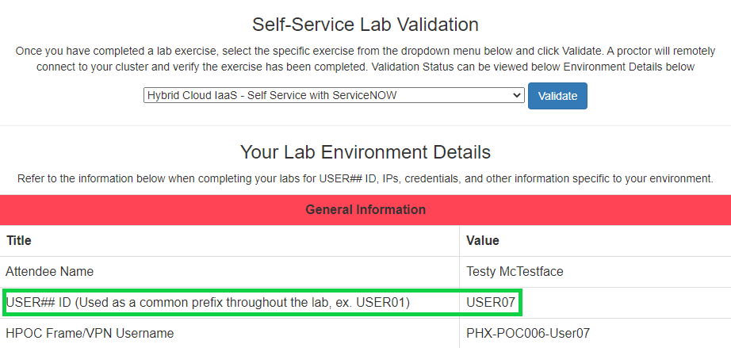
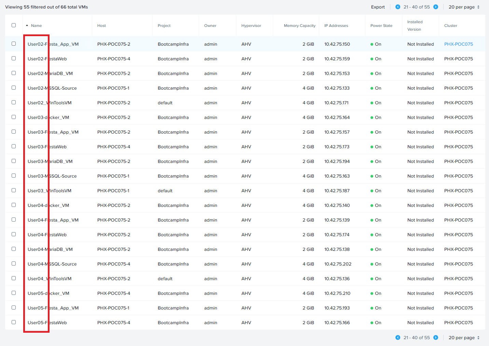

.. _clusterdetails:

----------------------------
Your Lab Environment Details
----------------------------

.. raw:: html

  <strong>DO NOT ATTEMPT TO CONNECT TO YOUR CLUSTER PRIOR TO THE DESIGNATED TIME ON MARCH 15th. Some clusters may be in-use for testing purposes, or be in the process of being staged for the event. Unauthorized access to the clusters during this time could negatively impact your lab experience. Thank you.</strong>  

Refer to the `Hands-On Labs <https://gts2021.ntnxevents.com/nutanixgtsindex>`_ page for the credentials to access the Lab User Lookup tool. *Sebastien would be mad if I put the credentials in GitHub.*

`Click here to access the Lab User Lookup tool <http://lookup.ntnxworkshops.com/>`_

.. note::

   If your cluster details are not found, verify you have entered the same e-mail address used to register for GTS (your Okta accout e-mail address, not an alias). If you still experience issues, ask for assistance in `#_gtsamer-general <slack://channel?team=T0252CLM8&id=C01N3LRUV9C>`_.

In addition to providing network and credential information, you will also be given a **USER**\ *##* **ID** (ex. USER01, USER02, etc.).

Unless explicitly instructed otherwise, you will use this value to label assets (VMs, policies, etc.) created throughout the labs. This value also identifies applications and VMs that have been pre-staged for you in order to more efficiently complete the labs.

.. raw:: html

  <strong>DO NOT ACCESS ANY USER LABELED VMs THAT ARE NOT ASSIGNED TO YOU.</strong> 

