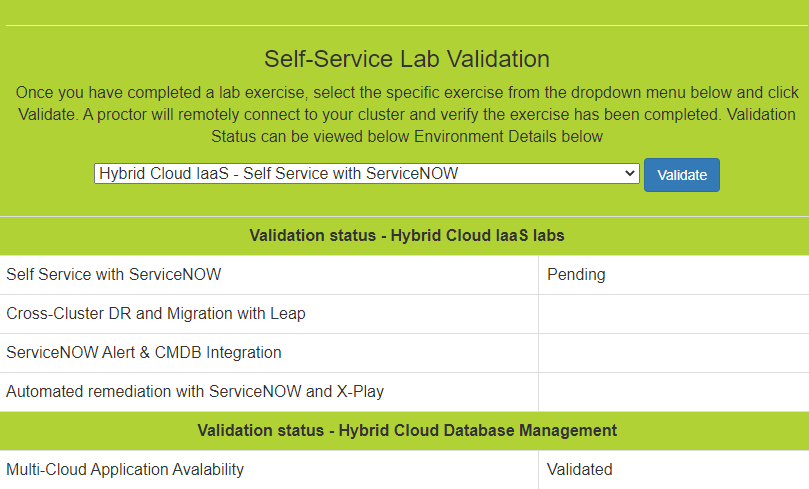

.. _validate:

--------------
Lab Validation
--------------

Marking your labs as completed has never been easier! This year you will be able to request validation of individual labs using the `Lab User Lookup <http://lookup.ntnxworkshops.com/>`_ tool.

After completing a lab exercise, simply return to your Lab User Lookup page, select the exercise you have completed and click the **Validate** button.

.. raw:: html

   <strong>DON'T BE A REASON WE CAN'T HAVE NICE THINGS! Proctors are checking if you have actually completed the exercise, this takes time. Please do not submit labs that you know you haven't completed.</strong> 

.. raw:: html

   <strong>Not all labs require validation. If you do not see the lab in the tool, it does not need to be validated.</strong> 

.. raw:: html

   <strong>You do not need to wait for validation to complete to continue to the next exercise.</strong> 
