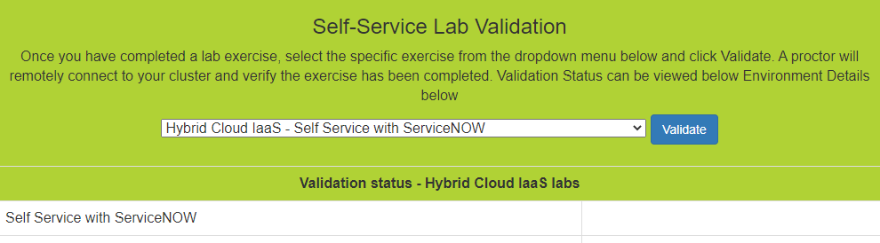

.. _validate:

--------------
Lab Validation
--------------

Marking your labs as completed has never been easier! This year you will be able to request validation of individual labs using the `Lab User Lookup <http://lookup.ntnxworkshops.com/>`_ tool.

After completing a lab exercise, simply return to your Lab User Lookup page, select the exercise you have completed and click the **Request Validation** button.

.. raw:: html

  <strong>You do not need to wait for validation to complete to continue to the next exercise.</strong> 
