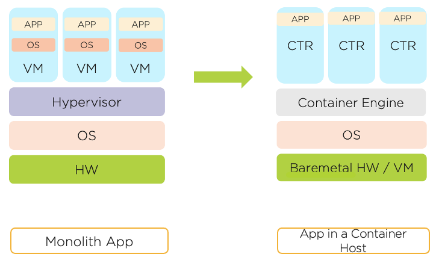

.. _karbon_getting_started:

---------------
Getting Started
---------------

This lab track is designed to provide you with hands-on experience in deploying and managing Kubernetes infrastructure using Nutanix Karbon and additional ecosystem solutions. The goal is to provide a more thorough understanding of core Kubernetes concepts, advantages and considerations regarding Cloud Native App infrastructure, and the value provided by Nutanix Karbon.

If you are not overly familiar with Kubernetes, review the `Kubernetes and You`_ primer below. Otherwise, review `Your Environment`_ for additional information about the lab *before* starting the lab.

Your Environment
++++++++++++++++

To let you experience the most fun and interesting parts of the lab, as well as accommodate the large number of simultaneous users, multiple components have already been staged for you. *Let's explore!*

Tools VM
........

.. note::

   It is highly recommended to complete the entire lab within your **USER**\ *##*\ **WinToolsVM** session. Connect to a fullscreen RDP session, open your lab guide inside of the VM. You'll thank me later.

The Windows Tools VM provides a number of different applications used across multiple Nutanix Bootcamps. Filter for your **USER**\ *##* in **Prism Central > Virtual Infrastructure > VMs** and take note of the IP of your **USER**\ *##*\ **WinToolsVM** VM, as you will be connecting to this VM via RDP (using **NTNXLAB** Administrator credentials).

   .. figure:: images/3.png

In the following labs you will use the Tools VM to access Kubernetes command line utilities, a graphical Kubernetes monitoring tool, and the **Visual Studio Code** text editor, which will be used to create and modify Kubernetes configuration files.

Fiesta MariaDB
..............

You will deploy the web tier of the Fiesta application as a Kubernetes service during the labs. The service will need to connect to a database to provide the application data.

The database VM, **User**\ *##*\ **-MariaDB_VM**, has already been provisioned for you.

Nutanix Objects
...............

To conserve memory and IP resources, each cluster runs a pre-staged Nutanix Objects Object Store. During the :ref:`environment_day2` lab you will use this Object Store to provision your own S3 bucket.

Kubernetes and You
++++++++++++++++++

What Are Containers?
....................

Containers are a standardized means of packaging software that include code and all its dependencies into an image, which allows an application to be reliably portable from one environment to another. The images run on an engine, such as Docker, which allows you to run multiple containers on the same host operating system while being completely isolated from one another.

Think about your desktop. You have many applications installed on your desktop and have probably experienced issues before where you needed certain versions of Java or Internet Explorer to run one app, but a completely different version to run another.

**By allowing an application to package all the runtimes, libraries, settings, and code needed to run, containers provide many advantages compared to traditional monolithic apps - including better resource utilization, greater portability and ability to continuously deploy.**

So Is Kubernetes Like Docker?
.............................

Kubernetes is an open source platform for *managing* containers, and *uses* Docker to run the underlying containers. Kubernetes supports multiple container engines, but Docker is the most prevalent. The containers are spread across multiple hosts, which Kubernetes manages as a cluster.

**Think about it this way - if Docker is AHV, the platform on which you run your VMs, then Kubernetes is Prism and AOS, the products that make your VM deployment resilient and easy to manage.**

So What Does It Do Then?
........................

`From Kubernetes.io: <https://kubernetes.io/docs/concepts/overview/what-is-kubernetes/>`_

*Containers are a good way to bundle and run your applications. In a production environment, you need to manage the containers that run the applications and ensure that there is no downtime. For example, if a container goes down, another container needs to start. Wouldn't it be easier if this behavior was handled by a system?*

*That's how Kubernetes comes to the rescue! Kubernetes provides you with a framework to run distributed systems resiliently. It takes care of scaling and failover for your application, provides deployment patterns, and more.*

You will see multiple practical examples of this throughout the lab.

So Is Kubernetes A PaaS For Containers?
.......................................

Since Kubernetes operates at the container level rather than at the hardware level, it provides some generally applicable features common to PaaS offerings, such as deployment, scaling, load balancing, and lets users integrate their logging, monitoring, and alerting solutions. However, Kubernetes is not monolithic, and these default solutions are optional and pluggable.

**Similar to Nutanix, Kubernetes provides the building blocks for building developer platforms, but preserves user choice and flexibility where it is important.**

What Basic Terms Should I Know?
...............................

Below are key terms you should know related to the core Kubernetes infrastructure. Other terms and concepts will be defined throughout the lab.

**Container**

Containers are launched from container images. They run on the same machine as other containers and share the OS kernel with other containers, but run as isolated processes in userspace.

**Pods**

A Pod represents a single instance of an application and can contain one *or more* containers. Containers within a Pod share storage volumes and network. Typically Pods only contain a single container, unless the containers have a "tightly coupled" use case.

**Service**

A service defines a logical set of Pods. They can be used to define dependencies between Pods and how they are accessed. Each Service gets its own unique IP address.

**Node**

A node is a host, or VM, that run Kubernetes workloads. The primary types of nodes are Master, etcd, and worker.

**Master Node**

The **Master** node acts as the API front-end of the Kubernetes cluster and manages workloads provisioned on **Worker** nodes. In a production cluster this role is distributed across multiple nodes.

**etcd Node**

**etcd** is a distributed (in multi-node configurations), key-value store (database) used to store Kubernetes cluster data. This includes all of the YAML data that describes the Pods, Services, and configurations we will be deploying on the cluster during the lab.

**Worker Node**

The **Worker** nodes run the Pods as assigned by the **Master** nodes. The number of **Worker Nodes** can be scaled up or down to meet the needs of the Pods being deployed.
