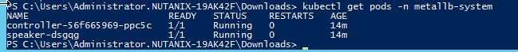
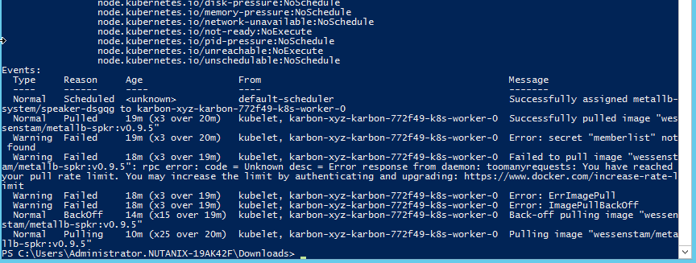

.. _environment_karbon:

Kubernetes configuration 
========================

After we have created and configured the needed pre-requirements in the earlier module, we are now going to configure our deployed Kubernetes cluster so we can start using it. in this part of the workshop we cover the following items:

- Get the kubeconfig file so we can interact with the kubernetes cluster
- Install and configure MetalLB Load Balancer that mimics the Load Balancers like you would have with Google, Azure or AWS as example.
- Install and configure Traefik Ingress Controller
- Install and configure dashboards so we can visualize the kubernetes cluster

.. note::
   Estimated time **45 minutes**

   All screenshots have the **Downloads** folder of the logged in user as the location where we save files

Interact with your kubernetes cluster
-------------------------------------

Kubernetes uses by default a file for authentication and not username and password combinations. This file, called kubeconf.cfg, has be downloaded and stored local. As we will be using the command line a lot during this part of the workshop, we are going to set an environmental variable so if the command line is closed, we still are able to use the file.

Follow these steps to get to interact with your kubernetes cluster.

#. Open the Karbon UI in Prism Central via :fa:`bars` -> Services -> Karbon (if not already)
#. Select your kubernets cluster by clicking the check box in front of the name.
#. Click on the **Actions** button and select **Download Kubeconfig**

   .. figure:: images/1.png

   .. raw:: html

      <strong> The downloaded kubeconfg fil is valid for 24 hours only (kubernetes security)! If you get error messages during later stages of the lab,kubectl doesn't have resourec XYZ, redownload the config file!</strong>

#. Click on the Blue **Download** text
#. Save the file somewhere on your machine, but remember where you have saved it as we need it in the next steps

.. note:: 
    When you get an error message from your browser about it could harm your machine, please click the **Keep** button.

    .. figure:: images/2.png

#. For Windows, open the Environment (Right CLick on the "start" button -> System -> Advanced System Settings -> Environment Variables)

   .. figure:: images/3.png

   #. Click on the **Environmental Variables** button and then on the **New...** button under the **User variables** (top of the screen)
   #. Create a new variable and use the following parameters
   
      - **Variable Name** - KUBECONFIG
      - **Variable Value** - <Path of where you stored the file>/kubectl.cfg (screenshot below is the default Download location of the Administrator user)
   
        .. figure:: images/5.png
   
   #. Close all the windows, you have opened with respect to setting the **Environment Variable**

#. For Linux or MacOS use the export functionality after you have opened the terminal session

#. Open a terminal or powershell (on Windows only) and type

   .. code-block:: bash

      kubectl get nodes

#. You should see something like the below screenshot

   .. figure:: images/6.png

   .. note::
    If you don't then check the variable you just set by typing **dir env:** in PowerShell or **set** on Linux/MacOS machine and check the **KUBECONFIG** variable and check that is pointing to the kubectl.cfg file you downloaded earlier

    .. figure:: images/7.png

External Load Balancer
---------------------

Customers that use kubernetes from a cloud provider like Google, AWS and Azure will have the benefit of Load Balancers. On Premise installation could use the same or have the possibility to use other Hardware Load Balancers like F5, Palo-Alto, NGINX Plus, HAProxy or whatever is available.

.. note:: 
   As we are limited by docker pull rules, we have decided to use a "proxy" for the images that are being pulled by the Kubernetes servers. (https://www.docker.com/increase-rate-limits#:~:text=Anonymous%20and%20Free%20Docker%20Hub,%3A%20toomanyrequests%3A%20Too%20Many%20Requests.&text=You%20have%20reached%20your%20pull%20rate%20limit)
   That means that we need to make same changes to the YAML files we will be using. We need to change the location where the images are to be pulled from.

Installation
^^^^^^^^^^^^

As there is a small difference in the Windows and Linux/MacOS versions of wget and therefore the installation we show them separately

For Windows
************

#. In a Powershell interface, type the following commands to install MetalLB 

   .. code-block:: bash
     
     cd <LOCATION WHERE TO STORE FILES>
     wget https://raw.githubusercontent.com/metallb/metallb/v0.9.5/manifests/namespace.yaml -OutFile namespace.yaml
     wget https://raw.githubusercontent.com/metallb/metallb/v0.9.5/manifests/metallb.yaml -OutFile metallb.yaml

Now that we have the yaml files we need to manipulate them so we grab the images from the "proxy" account.

#. Open metallb.yaml file in Visual Code via File -> Open.. 
#. Change the following two lines:

   - On **Line 316** change *metallb/speaker:v0.9.5* into **wessenstam/metallb-contr:v0.9.5**
   - On **Line 372** change *metallb/controller:v0.9.5* into **wessenstam/metallb-spkr:v0.9.5**

#. Save the file
#. Run these two commands

   .. code-block:: bash

      kubectl apply -f namespace.yaml
      kubectl apply -f metallb.yaml

   .. figure:: images/9.png

   .. note:: 
        We are going to use Notepad to **construct** the needed command as it allows of basic manipulation of text. Powershell does not like the extra lines in variables.

#. Open Notepad
#. Copy the below command Notepad
      
   .. code-block:: bash
        
        kubectl create secret generic -n metallb-system memberlist --from-literal=secretkey="<TO BE COPIED OUTPUT>"

#. Back in Powershell, run
      
   .. code-block:: bash
      
      openssl rand -base64 128

#. Copy the output of the command in your Notepad in place of the text <TO BE COPIED OUTPUT> and remove the extra lines at the end of the copied key.
#. Copy the entire long line into the Powershell session and run the command
   
   .. figure:: images/8.png

For Linux/MacOS
****************

#. In a terminal session, type the following commands to install MetalLB 

   .. code-block:: bash
     
     cd <LOCATION WHERE TO STORE FILES>
     wget https://raw.githubusercontent.com/metallb/metallb/v0.9.5/manifests/namespace.yaml -O
     wget https://raw.githubusercontent.com/metallb/metallb/v0.9.5/manifests/metallb.yaml -O

#. Open metallb.yaml file in Visual Code via File -> Open.. 
#. Change the following two lines:

   - On **Line 316** change *metallb/speaker:v0.9.5* into **wessenstam/metallb-contr:v0.9.5**
   - On **Line 372** change *metallb/controller:v0.9.5* into **wessenstam/metallb-spkr:v0.9.5**

#. Save the file
#. Run these two commands

   .. code-block:: bash

      kubectl apply -f namespace.yaml
      kubectl apply -f metallb.yaml

#. When you are running MacOS or Linux use:

   .. code-block:: bash

     kubectl create secret generic -n metallb-system memberlist --from-literal=secretkey="$(openssl rand -base64 128)"

For all systems
***************

Now that we have installed MetalLB we need to make sure that the Pod are in a running state. To do this open your terminal or Powershell sessions and type 

.. code-block:: bash

   kubectl get pods -n metallb-system

This should show that there are two Pods, one with in the name controller and one with in the name speaker and they should have the status Running

If you don't see this status,we have to investigate what is the issue at hand. We can do this simply by looking at the command 

.. code-block:: bash

   kubectl describe pods <name of the POD that has an issue> -n metallb-system

This will show detailed information on the pod, the statuses and errors. INvestigate the last part of the information to get a direction where to search. Mostly it has been that the name of the image has been typed wrong, or not changed at all..
   

Configuration
^^^^^^^^^^^^^

Now that we know are sure that we have the Pods running we need to configure MetalLB. To do this we need to create a small yaml file that holds the IP range that we can use for MetalLB

.. raw:: html

   <strong> Make 100% sure you are using YOUR assinged IP addresses (2x) from the Lookup tool! Otherwise the other users on the cluster will suffice strange issues</strong>

Follow these steps to get the configuration created for MetalLB

#. Open Visual Code
#. Create a New File and copy the below text

   .. code-block:: yaml
     
     apiVersion: v1
     kind: ConfigMap
     metadata:
       namespace: metallb-system
       name: config
     data:
       config: |
         address-pools:
         - name: metal-lb-ip-space
           protocol: layer2
           addresses:
           - <START IP RANGE>-<END IP RANGE>

#. Example could be

   .. code-block:: yaml
     
     apiVersion: v1
     kind: ConfigMap
     metadata:
       namespace: metallb-system
       name: config
     data:
       config: |
         address-pools:
         - name: metal-lb-ip-space
           protocol: layer2
           addresses:
           - 10.42.3.45-10.42.3.49

#. Save the file in your location of choice as **metallb-config.yaml**
#. Run this command to get the configuration activated

   .. code-block:: bash
     
     kubectl apply -f metallb-config.yaml

   .. figure:: images/12.png

Now that we have a LoadBalancer like the Pulbic Cloud providers let's start to use it. To do that we are going to install Traefik as a Ingress controller, but use a "public IP address" so we can access it from our machines without the need of an extra component.

Traefik
-------

Traefik (http://traefik.io) can be used to route inbound traffic, based on URLs, from machines to specific Pods. We are going to use Traefik in a later state of this module.

To do that we need to follow some steps. Installation, deploying and exposing the Traefik Pod using MetalLB.

Installation
^^^^^^^^^^^^

We need to provide Kubernetes specific RBAC rules so Traefik can see the new rules and be able to access the Pods we are going to have routed like our Fiesta Application. 

#. Run the following commands in your Terminal or Powershell session.

   .. code-block:: bash

      kubectl apply -f https://raw.githubusercontent.com/wessenstam/gts2021-prep/main/Karbon/yaml%20files/01-traefik-CRD.yaml
      kubectl apply -f https://raw.githubusercontent.com/wessenstam/gts2021-prep/main/Karbon/yaml%20files/02-traefik-svc.yaml
      kubectl apply -f https://raw.githubusercontent.com/wessenstam/gts2021-prep/main/Karbon/yaml%20files/03-traefik-Deployment.yaml

   .. figure:: images/13.png

#. These commands have done the following

   #. Create a Custom Resource Definition (CRD) including RBAC for Traefik. CRDs extend the API of Kubernetes with specfic definitions. More can be found here: https://kubernetes.io/docs/concepts/extend-kubernetes/api-extension/custom-resources/
   #. Created a service of the Type LoadBalancer (use MetalLB) so we can access the Webpage over the "normal" IP addresses in the rangr we defined for MetalLB
   #. Created the needed Pods for Traefik

#. Run the following command to see the Traefik UI "public" IP addresses

   .. code-block:: bash

      kubectl get svc

#. This should show something under the column of **EXTERNAL-IP**. 

   .. figure:: images/14.png

   .. note:: 
      If you see Pending, the configuration of MetalLB has not been successful! Use **kubectl describe configmap config -n metallb-system** to see the configuration of MetalLB in the Kubernetes cluster and check the IP address range values.

      .. figure:: images/15.png

#. Open a browser and point to http://<EXTERNAL-IP_TRAEFIK>:8080. This should show the Traefik UI.

   .. figure:: images/16.png

Now that we have our LoadBalancer (MetalLB) and Ingress Controller (Traefik) running we want to have some monitoring for the system. The next part of this workshop is all about dashboards. 

Dashboards
----------

There are an enormous amount of possibilities, but we'll discuss three different dashboards. The built-in Kubernetes Dashboard, Portainer and the Lens dashboard which is running on your local machine. The other two are pods inside of the Kubernetes cluster.

Kubernetes Dashboard
^^^^^^^^^^^^^^^^^^^^

For the installation and exposure of this dashboard we are going to use the Load Balancer so we can access it even when Traefik, the ingress controller has some issues. This is not the most secure way of working, as we can do a lot from the dashboard with respect to manipulating the environment.

#. Install the Kubernetes Dashboard using the following command
 
   .. code-block:: bash

      kubectl apply -f https://raw.githubusercontent.com/wessenstam/gts2021-prep/main/Karbon/yaml%20files/05-k8s-dashboard.yaml

#. To see the EXTERNAL-IP so we can open the Dashboard, use the **kubectl get svc -n kubernetes-dashboard** command

   .. figure:: images/17.png

#. Open the browser and point it to https://<EXTERNAL-IP_DASHBOARD>/ and "bypass" the certification for your browser.
#. In the screen that opens in the browser select Kubeconfig and point to your kubectl.cfg file you have downloaded earlier using the three dots and click the **Sign in** button. 

   .. figure:: images/18.png

#. You now have the opportunity to manage your Kubernetes Cluster using this dashboard. The statuses for the different Deployments, Pods and Replica Sets

   .. figure:: images/19.png

#. Click around to look at some items on the left side to see if you see something familiar

Portainer
^^^^^^^^^

Portainer is another dashboard that, eventhough still in development, is also avaialble can be used to deploy Pods as well.

#. Install the Portainer dashboard using

   .. code-block:: bash

      kubectl apply -f https://raw.githubusercontent.com/wessenstam/gts2021-prep/main/Karbon/yaml%20files/06-portainer.yaml

#. Running the below command you will see that the Portainer service has NO EXTERNAL-IP

   .. code-block:: bash

      kubectl get svc -n portainer

   .. figure:: images/20.png

For Portainer we are going to use the Traefik Ingress Controller to "route" http://portainer.gts2021.local to the Portainer Pod via the service

#. In Visual Code, create a new file and copy the below content in the file.

   .. code-block:: yaml
      
      apiVersion: traefik.containo.us/v1alpha1
      kind: IngressRoute
      metadata:
        name: simpleingressroute
        namespace: portainer
      spec:
        entryPoints:
          - web
        routes:
        - match: Host(`portainer.gts2021.local`)
          kind: Rule
          services:
          - name: portainer
            port: 9000

#. Save the file as **traefik-routes.yaml** in the location where you also have the other yaml files.
#. Run **kubectl apply -f traefik-routes.yaml** to have Traefik configure the route to the Portainer application.

As our machine has no idea where to find that machine (portainer.gts2021.local), we need to tell it by adding the external IP address of Traefik to the hosts file. 

#. Manipulate the hosts file using your tool off preference

   .. note::
      In Linux and MacOS this file is located in \/etc\/. Make sure you are using the root account or sudo to manipulate the /etc/hosts file. For Windows this file is located in **C:\Windows\System32\Drivers\etc\hosts**. To manipulate this file you MUST use notepad with evelated rights, otherwise you are not allowed to save the file.

   .. figure:: images/21.png

#. Save the file
#. In the Terminal or Powershell session type **ping portainer.gts2021.local** and you should see that the FQDN is translated in the EXTERNAL IP address of the Traefik application and there should **NOT** be a ping reply. If the IP address not returned correct, it may be that you or 1) mistyped the line in the hosts file, or 2) forgotten to save the hosts file.
#. Open the browser and point it to http://portainer.gts2021.local/

   .. raw:: html

      <bold>Don't forget the trailing \/ ! otherwise you will not get a reply</bold>

   .. figure:: images/23.png

#. Provide the password of your choice in Portainer to go to the next screen. and click the **Create User** button
#. Click the **Connect Button** at the left bottom corner,as *Kubernetes* has already been selected.
#. Leave all default in the next screen and click the **Save configuration** button to start working with Portainer
#. Browse through the dashboard and have a look around...
#. Click on **Applications** in the left hand side and click on the 2 on the blue bar (right bottom corner) to see the rest of the Applications (Pods)

   .. figure:: images/24.png

#. Click on traefik and scroll down till you see the **Logs** and **Console** buttons

   .. figure:: images/25.png
 
#. Here you can open the logs und execute some commands in the Pod/Container. Maybe for some debug settings....

.. _lens:

Lens
----

Organizations might not always want to have their Kubernetes cluster to also run the monitoring solution. One way to solve this is to have an application in stalled on a machine that can "talk" to the Kubernetes cluster alike the Kubernetes Dashboard. Lens is such an application and can be downloaded at http://k8slens.dev

#. Download Lens for you computer from the URL http://k8slens.dev
#. Install the application using the default settings
#. Lens will start after the installation is done. Click the **Ok, got it!** button to proceed
#. Click the BIG **+** sign in the top left corner to add your cluster

   .. figure:: images/26.png

#. Provide the location of your kubectl.config file and click **Add cluster**

   .. figure:: images/27.png

#. The application is connecting to your Kubernetes cluster and is showing information on the performance

   .. figure:: images/28.png

#. Browse around in Lens to see if this might be something for you....
#. Click on Worklodas -> Pods and search your traefik pod. Click on it and you'll be presented with the information for
 
   - CPU
   - Memory
   - Network
   - Filesystem

   .. figure:: images/29.png

#. If your interested in the logging of the Traefik pod, click in the right top corner on the second icon from the left (the sniplet icon).

   .. figure:: images/30.png

   .. figure:: images/31.png

Now that we have an infrastructure running, can control/route URL based traffic, and we can visualize what is happening using a few dashboards, let's move into the deployment of our Fiesta App and use the MariaDB database that we provisioned earlier in the Workshop.

During the rest of the workshop we will be using Lens as the dashboard. Reason is that the application runs on your machine and can be integrated into any Kubernetes environment. Nothing is needed like Traefik or other LoadBalancer or means of communicating with the Cluster.

.. raw:: html

     
<h2>That concludes this module!</H2>

------

Takeaways

- Karbon is like a normal Kubernetes cluster, all known commands to manage a native Kubernetes cluster are the same
- As Karbon is nothing more then a way of building and maintaining a Kubernetes Cluster, all available Pods, Applications, installations and configurations are exactly the same. THere is nothing that need to be manipulated so it works with the Karbon platform
- Building relatively quickly an infrastructure on top of Kubernetes with a choice of dashboards for basic monitoring is quite easy to setup

