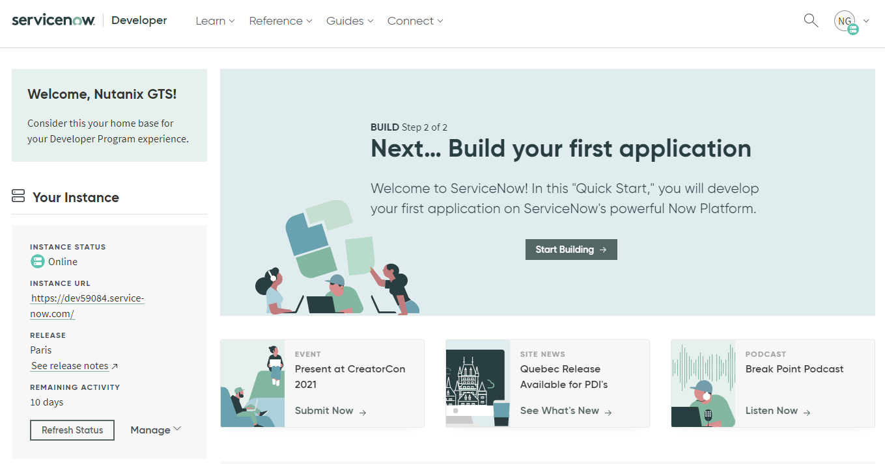

.. _snow_gettingstarted:

---------------
Getting Started
---------------

This lab track is designed to showcase Nutanix as an ideal platform for delivering a true hybrid cloud for self-service IaaS, leveraging both the flexibility of AWS and Nutanix Clusters and integration with IT service management platform, ServiceNow.

PTE is looking to pivot away from brick and mortar and ramp up their eCommerce offerings, including entertainment and gaming services to spice up Zoom parties, and planning services to re-invigorate safe and socially distant in-person gatherings. They are hiring new app developers and signing contracts with consultants daily. Unfortunately, the existing IT team has been unable to keep up with the demands of the growing team.

The primary datacenter, located outside of Chicago, Illinois, is nearing maximum capacity. This has left the team unable to easily add new server and storage capacity to address recent growth, resulting in disruption to their existing workloads.

   *Primary datacenter location of Party Time, Excellent Inc.*

In addition to quickly providing more capacity for workloads, PTE must also provide self-service access for developers to maintain peak efficiency and bring new offerings to market quickly. As their business now solely depends on the uptime of their infrastructure, disaster recovery and active/active datacenters are critical design components - as is ensuring workloads remain secure regardless of where they run in the environment. Finally, automating infrastructure remediation for user issues will help the IT scale operations to support their new influx of internal customers.

A solution to all of that would be truly...

.. figure:: https://media.giphy.com/media/3oEjI8vagntG7EDxgQ/giphy.gif
   :align: center

Your Environment
++++++++++++++++

To let you experience the most fun and interesting parts of the lab, as well as accommodate the large number of simultaneous users, multiple components have already been staged for you. *Let's explore!*

Clusters on AWS
...............

#. Refer to :ref:`clusterassignments` for the details required to access your environment.

#. With **Prism Central** in your browser and log in with the provided credentials.

Your **pre-staged** Clusters on AWS cluster has been registered to your existing Prism Central instance. If you have not already viewed the Clusters walk through, refer to that now to understand how this environment is deployed.

.. figure:: images/2.png

By leveraging Clusters, you have overcome PTE's inability to quickly procure and deploy new infrastructure in their datacenter, and can now address their additional needs regarding disaster recovery, network security, and infrastructure self-service.

ServiceNow
..........

The larger and more diverse an organization’s IT environment is, the more they need robust IT process to mitigate and manage risk. The need to follow agreed and approved processes is paramount when organizations are running critical business applications on which things like corporate profit, human lives, or financial markets may depend.

IT organizations want to find a simple way for all end-users to get IT services via a singe portal, and they want everything automated! With many platforms in the mix, **ServiceNow is where they all come together so IT organizations can have one set of processes for all platforms**.

To simplify and accelerate developing new apps and integrations for the platform, ServiceNow `provides free developer instances of its entire platform <https://developer.servicenow.com/>`_ to users - *these instances are great for labs and demos too!*

In addition to your on-prem and AWS Nutanix clusters, each group of users will share a **pre-staged** ServiceNow Developer Instance. We'll cover more about the environment throughout the labs.

