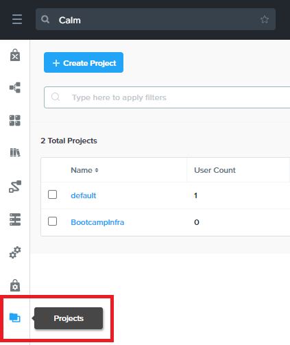

.. _snow_preparingenv:

--------------------------
Preparing Your Environment
--------------------------

With the additional infrastructure capacity Alex has unlocked with Nutanix Clusters, one of the goals is to provide users with the ability to request and operate their owns VMs and applications. Depending on the user and/or application, Alex wants to ensure that VMs are properly protected for backup and DR purposes, as well as properly secured on the network from the time of creation.

In this exercise, you'll configure example policies in Prism Central for both data protection and microsegmentation that can be applied to apps and VMs. Afterwards, you'll configure a Calm project and Blueprint to use as your first self-service VM offering.

Configuring Data Protection
+++++++++++++++++++++++++++

#. In **Prism Central**, select :fa:`bars` **> Virtual Infrastructure > Categories**.

   .. figure:: images/1.png

#. Click **New Category** and fill out the following:

   - **Name** - *USER##*-DP (ex. USER01-DP)
   - **Purpose** - Used for VM data protection and replication policy assignment.
   - **Value** -
      - Bronze
      - Silver
      - Gold

   .. figure:: images/3.png

#. Click **Save**.

#. In **Prism Central**, select :fa:`bars` **> Policies > Protection Policies**.

#. Click **Create Protection Policy** and fill out the following:

   - **Policy name** - *USER##*-Bronze (ex. USER01-Bronze)
   - **Primary Location > Location** - Local AZ
   - **Primary Location > Cluster** - AWS-Cluster
   - Click **Save**
   - **Recovery Location > Location** - Local AZ
   - **Recovery Location > Cluster** - *Your POC### Cluster*
   - Click **Save**

   .. figure:: images/5.png

   <Stuff about single PC being one AZ>

#. Click **+ Add Schedule** and fill out the following:

   - **Protection Type** - Asynchronous
   - **Take Snapshot Every** - 1 Hour(s)
   - **Retention Type** - Linear
   - **Retention on Local AZ : AWS-Cluster** - 5 Recovery Point(s)
   - **Retention on Local AZ : POC### Cluster** - 5 Recovery Point(s)
   - Select **Reverse retention for VMs on recovery location**

   .. figure:: images/6.png

      Enabling reverse retention will allow bi-directional replication to take place between specified sites, reducing the number of policies needed to be managed for an active/active datacenter configuration, as desired by Alex.

#. Click **Save**.

#. Click **Next**.

#. Under **Categories**, select your **USER##-DP : Bronze** value and click **Add**.

   .. figure:: images/7.png

   Observe that there are not currently any VMs on either cluster with that assigned category value. This will occur as new VMs are provisioned in a later exercise.

#. Click **Create**.

   .. note::

      Optionally, you can create additional policies for Silver and Gold, using the respective category values. For example, a Gold policy could provide Asynchronous snapshots every 5 minutes.

   <That's it, could add multiple recovery locations with different schedules, will come back to this>

Configuring Network Isolation
+++++++++++++++++++++++++++++

You'll begin by assigning Category values to VMs that will be used in the data protection and microsegmentation policies. Nutanix Categories can... Simple policy designed to prevent non-production VMs from communicating with production webservers.

#. In **Prism Central**, select :fa:`bars` **> Virtual Infrastructure > Categories**.

#. Observe the pre-staged **User** category with values mapping to your lab user assignment in :ref:`clusterdetails`, as well as the system default category **Envrionment**. These are the two categories you will use to create your microsegmentation policy.

   .. figure:: images/2.png

#. Select :fa:`bars` **> Virtual Infrastructure > VMs**

#. Click **Filters**. Under **Name**, specify your *USER##* lab ID to search for pre-staged VMs.

   .. figure:: images/4.png

   You'll find a CentOS webserver running a Node-based inventory management application, and a Microsoft SQL database storing its associated data.

   .. note::

      You can view the web interface of the application by opening \http://<*USER##-FiestaWeb-VM-IP*>.

#. Right-click your **USER##-FiestaWeb** VM and select **Manage Categories**.

   .. figure:: images/8.png

   .. note::

      When right-clicking, you may need to scroll down to view all available actions. Alternatively, you can select the VM and click the **Actions** menu toward the top of the screen.

   As these VMs were provisioned as part of a Calm Blueprint, you will observe that they already have multiple categories automatically applied.

#. In the **Search** field, specify the **Environment: Production** category and click :fa:`plus-circle` to add it.

#. Search for **User** and select the **User:** *##* value based on your :ref:`clusterdetails` assignment.

   .. figure:: images/9.png

#. Click **Save**.

#. Repeat this process to add *ONLY* the **Environment: Production** category to your **USER##-MSSQL-Source** VM. Do *NOT* add the **User: ##** category to this VM!

#. In **Prism Central**, select :fa:`bars` **> Policies > Security**.

#. Click **Create Security Policy**.

   Nutanix Flow is capable of...

#. Select **Isolate Environments** and click **Create**.

   .. figure:: images/10.png

#. Fill out the following fields:

   - **Name** - *USER##*-IsolateEnv (ex. USER01-IsolateEnv)
   - **Purpose** - Isolate Dev and Prod USER:*##* VMs
   - **Isolate this category** - Environment:Production
   - **From this category** - Environment:Dev
   - Select **Apply the isolation only within a subset of the datacenter**
   - Specify **User:**\ *##*
   - **Select a Policy mode** - Enforce

   .. figure:: images/11.png

   .. note::

      The **Apply the isolation only within a subset of the datacenter** functions like an **AND** operator, ensuring only VMs tagged as both Production and User## will be isolated from VMs tagged as both Dev and User##. This allows for more fine-grained application of policy.

#. Click **Save and Enforce**.

   If you select your newly created policy, you'll observe that no traffic has yet been discovered, as there are currently no VMs assigned to Environment:Dev and your user designation. This will occur as part of the self-service provisioning process.

Creating A Calm Project
+++++++++++++++++++++++

Calm provides...Creating your own project will allow you to...

#. In **Prism Central**, select :fa:`bars` **> Services > Calm**.

#. Select **Projects** from the left-hand toolbar and click **+ Create Project**.

#. Specify *USER##*\ **-Project** (ex. USER01-Project) as your **Project Name**.

#. Under **Users, Groups, and Roles**, fill out the following:

   - **Name** - Bootcamp Users
   - **Role** - Operator
   - Click **Save**

   .. figure:: images/13.png

#. Under **Infrastructure**, click **Select Provider > Nutanix**.

#. Click **Select Clusters & Subnets**.

#. Specify both your **AWS-Cluster** and **POC###** clusters. As shown in the screenshot below (We know, we're telling you to look at a screenshot for information), select the **User VM Network** and **Secondary** subnets.

   .. figure:: images/14.png

#. Click **Confirm**.

#. Select the :fa:`star` icon to mark the **AWS-Cluster** network as the default and click **Save & Configure Environment**.

   .. figure:: images/15.png

   .. note::

      You **DO NOT** need to complete the **Environment** configuration as you will not be using Marketplace Blueprints in the upcoming exercises.

Uploading A Calm Blueprint
++++++++++++++++++++++++++

For the purposes of this exercise... simple Blueprint... see XYZ labs for instruction on creating your own...

#. `Download the Single VM CentOS Blueprint by right-clicking here and saving. <https://raw.githubusercontent.com/nutanixworkshops/gts21/master/snow/plugins/CentOS%20VM.json>`_

#. From the left-hand toolbar in **Calm**, select **Blueprints**.

   .. figure:: images/16.png

#. Click **Upload Blueprint** and select the **CentOS VM.json** file downloaded in Step 1.

#. Update the **Blueprint Name** to include your *Initials* or *USER##* and select the Calm Project you created in the previous exercise.

   .. figure:: images/17.png

#. Click **Upload**.

   Before the Blueprint can be used, the networks, disk images, and credentials must be configured for your environment. Additionally, you will incorporate the categories associated with your data protection and network isolation policies.

#. Within your **CentOS VM** Blueprint, click **VM Details**.

#. Select the **Cloud** dropdown and observe that, in this environment, Nutanix AHV is the only option.

   <key benefit of clusters being native AHV...>

#. Click **VM Configuration**.

   Here you'll see the specifications for the VM being provisioned. Observe that a Calm macro, or variable, is being used to customize the VM name by prepending the user's initials.

#. Click the **Runtime** icon for both **vCPUs** and **Memory** to allow for customization of these values at the time of launch.

   We will use this in a later exercise to allow a ServiceNow administrator to create multiple catalog offerings from the same Blueprint.

   .. figure:: images/18.png

#. Under **Disks > Disk (1) > Image** select **CENTOS7** to clone from the existing disk stored within the Prism Image Service.

   .. figure:: images/19.png

#. Under **Categories**, add the following categories to assign your data protection and network isolation policies during VM creation:

   - **Environment: Dev**
   - **USER: ##**
   - **USER##-DP: Bronze**

   .. figure:: images/20.png

   .. note::

      While Calm supports category customization at runtime, this functionality is not yet supported in the Calm Plug-in for ServiceNow.

#. Under **NICs**, ensure the **Runtime** option is enabled. Select **User VM Network** with a **Dynamic** IP.

   This will ensure all newly requested VMs are provisioned in the easily expandable AWS Clusters environment by default, ensuring Alex doesn't put any additional pressure on their on-prem environment. Leaving it as a runtime variable will allow a ServiceNow administrator additional flexibility in defining the self-service offering.

   .. figure:: images/21.png

#. Click **Advanced Options**.

#. Under **Credentials**, click **Add/Edit credentials**. Specify a password the **ROOT** credential (ex. *nutanix/4u*).

   This will be configurable for the user at runtime, but Calm requires a default value by provided before the Blueprint can be launched.

   .. figure:: images/22.png

#. Click **Done**.

#. Click **Save**.

   .. note::

      You should no longer see any red error alerts for the Blueprint, but warning alerts related to missing variable values are expected and will not impact the Blueprint.
