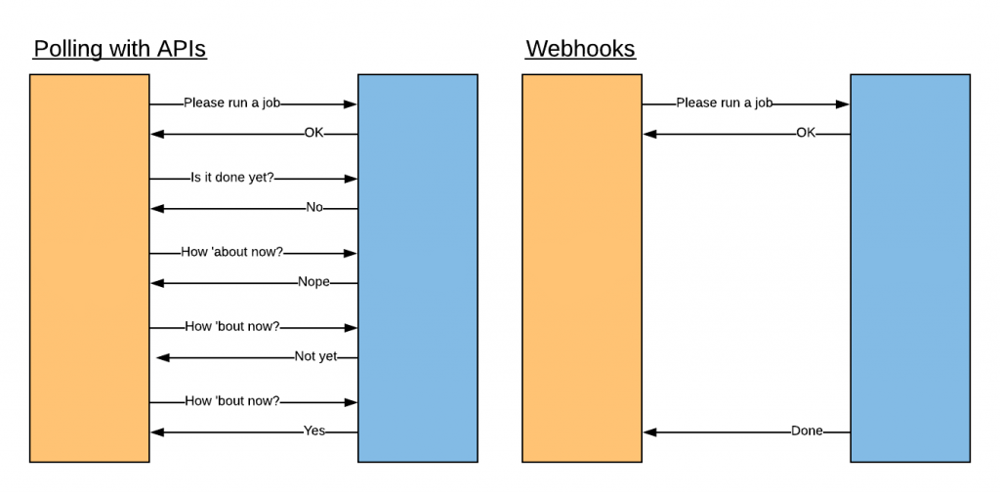

.. _snow_webhook:

------------------------------------------------
Automated Remediation with ServiceNow and X-Play
------------------------------------------------

Having Prism send key alerts to ServiceNow opens up a world of additional ITOM workflows for applications running on Nutanix infrastructure - but can it deliver on automated remediation based on those alerts?

*But lab guide! Can't Prism X-Play do that too?!*

Great point, astute reader! X-Play makes easy work of automating datacenters ops, but combining it with ServiceNow (similar to the Calm Plugin) provides added visibility and an enterprise-grade rules engine to process data. Prism now supports launching X-Play Playbooks via webhook, making this integration possible.

What *is* a webhook? Typical APIs are a request, followed by a response. Webhooks simply send data when it's available. To use a webhook, you register a URL with some service you want to send you data. That URL is a place within your application that will accept the data and do something with it. Whenever there’s something new, the webhook will send it to your URL. As seen in the image below, webhooks are much more efficient for handling events than continually polling a service.

In this exercise, you'll create a Webhook to allow a ServiceNow Flow to conditionally launch a Nutanix Playbook. Building off the previous exercise, the goal is to automatically increase memory assigned to your VM during periods of increased utilization.

Creating Add Memory Playbook
++++++++++++++++++++++++++++

First you'll create the X-Play Playbook that will ultimately add memory to your impacted VM, after the alert has been processed by ServiceNow.

#. In **Prism Central**, select :fa:`bars` **> Operations > Playbooks**.

#. Click **Create Playbook**.

#. Under **Select a Trigger**, click **Webhook > Select**.

#. Click **+ Add Action** and select **VM Add Memory**.

#. Fill out the following fields:

   - **Target VM** - Webhook: entity1
   - **Memory to Add** - 1 GiB
   - **Maximum Limit** - 5 GiB

   .. figure:: images/1.png

#. Click **Save & Close**.

#. Specify **User**\ *##*\ **Memory Add** as the **Name** and toggle the **Playbook Status** to **Enabled**.

   .. figure:: images/2.png

#. Click **Save**.

#. In **Playbooks > List**, click the name of your **User**\ *##*\ **Memory Add** Playbook.

#. Observe that the webhook has been populated with the **URL** that Prism Central will expect to receive incoming data, along with the **Body** that defines the format of the expected data.

   **entity1** will define the VM which will receive an increase in memory. Observe that this value is made up of a **type** (vm), the VM **name**, and the VM **uuid**.

#. Copy the **URL** and **Body** values to a blank text file, as this will both be used later in the exercise.

   .. figure:: images/3.png

Creating ServiceNow Event Rules
+++++++++++++++++++++++++++++++

ServiceNow Event Rules give us the ability to perform additional data manipulation of a record when a set of conditions is met. In this scenario, we are leveraging an Event Rule to expose data from the Nutanix alert needed for the webhook.

#. Log into your ServiceNow instance as **admin**.

#. In the **Filter Navigator** field in the upper-left, search for **All Events**.

#. Select the event that corresponds to the **Alert** you previously generated for high memory usage.

   .. figure:: images/4.png

#. Observe that the **uuid** value required to your webhook is provided as part of the **Additional Information** field.

   This string can be isolated by performing additional processing of future events using an **Event Rule**.

   .. figure:: images/5.png

#. Copy the **Resource** and **vm_uuid** values to a scratch document (ex. Notepad), as they will be used to test your webhook later in the exercise.

#. Click **Create Event Rule**.

#. Specify **User**\ *##* **Alerts** (ex. user01 Alerts) as the **Name**.

   .. figure:: images/6.png

#. Select the **Event Filter** tab.

#. Under **All of these conditions must be met**:

   - Select **Resource**
   - Select **starts with**
   - Specify your **USER**\ *##* (or whatever unique value prepends your VM name - *THIS IS CASE SENSITIVE!*)
   - Click **AND**
   - Select **Metric Name**
   - Select **is**
   - Specify **memory_usage_ppm**

   .. figure:: images/7.png

   This filter will ensure the rule applies to all incoming Memory Usage alerts for *your VMs only*.

#. Select the **Transform and Compose Alert Output** tab.

#. Replace the unused **Description** value with **${vm_uuid}** and click **Submit**.

   .. figure:: images/8.png

   The Flow you will create in the following exercise will now have easy access to the **vm_uuid** value.

   Before moving on to the next section, you should validate that your new Event Rule will be applied to future alerts.

#. In the **Filter Navigator** field in the upper-left, return to **All Events**.

#. Select the event that corresponds to the **Alert** you previously generated for high memory usage.

      .. figure:: images/4.png

#. Under **Related Links** at the bottom of the page, click **Check processing of event**.

   The message at the top of the screen should indicate your event matches the **USER**\ *##*\ **Alerts** rule you have created. If this rule does **NOT** match the event, return to your Event Rule and double check your **Resource** name is correct (CASE SENSITIVE).

   .. figure:: images/29.png

Creating A ServiceNow Flow
++++++++++++++++++++++++++

Similar to a Playbook, Flows are processes consisting of a sequence of actions and a trigger, designed to auto business logic for a particular application or process. This Flow will process Alert data and pass variables to an Action responsible for issuing a REST API call to trigger your Playbook webhook.

Building the Action
...................

#. In the **Filter Navigator** field in the upper-left, search for **Studio**. The Studio will open in a new tab.

#. Select the existing **Nutanix Calm** application.

   .. figure:: images/9.png

   To simplify the lab, we'll add this Flow to our existing **Nutanix Calm** application, rather than create a new namespace and tables.

#. In the upper-left of **Studio**, click **+ Create Application File**.

#. In the **Filter** field, search for and select **Action**.

   Again, similar to Playbooks, Actions allow a user to perform a task without having to explicitly write any code.

   .. figure:: images/10.png

#. Click **Create** to launch the **Flow Designer**.

   .. note::

      The Flow Designer opens in a separate window and may be blocked as a popup by your browser.

      You may need to expand the Flow Designer browser window to view all fields mentioned in the following steps.

#. Under **Action Properties**, specify **User**\ *##*\ **-RESTAPI** as the **Name** and click **Submit**.

   .. figure:: images/11.png

#. Click **+ Create Input** 3 times to create 3 input variables for your Action.

#. Change the labels of your inputs to **type**, **name** and **uuid**, respectively (this will also update the values in the **Name** field).

   .. figure:: images/12.png

#. Leave the default **String** type and toggle the **Mandatory** switch for each variable.

#. Under **Action Outline**, select the **+** icon to add a step to your Action.

   .. figure:: images/13.png

#. Review the available capabilities, including ServiceNow data manipulation and approval requests.

   ServiceNow IntegrationHub subscription packages provide integrations, called Spokes, to many web services, including: WebEx, Microsoft Teams, Twilio, Zoom, Ansible, Azure, Docker, GitHub, Jenkins, Kubernetes, InfoBlox, GSuite, Active Directory, Okta, and more.

#. Under **Integrations**, select **REST** to perform a web service request.

#. Under **Connection Details**, fill out the following:

   - **Connection** - Define Inline Connection
   - **Credential Alias** - x_nuta2_nutanix_ca.NutanixPrism

   *This value was pre-staged and performs Basic Auth to Prism using your Prism admin credentials. This same credential is also used by ITOM Discovery.*

   - Select **Use MID**

   *This will leverage the local MID Server on the Nutanix cluster to issue the REST API, as your cluster is not directly routable to the ServiceNow instance in this environment.*

   - **Base URL** - *Paste your Webhook URL from your Playbook* (ex. https://10.XX.XX.39:9440/api/nutanix/v3/action_rules/trigger)

   - **MID Application** - Discovery
   - **Capabilities** - ALL

   *These fields help determine which MID Server to use for the REST API call in environments with multiple MID Servers. These selections match default settings for the MID Server deployed on your cluster.*

      .. figure:: images/14.png

#. Under **Request Details**, fill out the following:

   - **HTTP Method** - POST
   - Under **Headers**, click **+** to add an entry
   - **Name** - Content-Type
   - **Value** - application/json

   .. note::

      Double check you are creating **Content-Type application/json** under **Headers** and not **Query Parameters**!

   *This will allow sending data in the API call body back to the Prism webhook in the expected format.*

   .. figure:: images/15.png

#. Under **Request Content**, paste your Webhook Body in the **Request Body[Text]** field.

#. Remove all **optional** fields except **entity1** (*string1-string5, integer1-integer5, entity2*), as shown in the screenshot below.

   .. figure:: images/16.png

#. Replace **<ENTITY_TYPE>**, **ENTITY_NAME>**, and **<ENTITY_UUID>** with the appropriate **Input Variables** by dragging and dropping from the **Data** column.

   Your finished **Request Body** should resemble the screenshot below, with your unique **webhook_id**.

   .. note::

      Watch out for typos, including missing escape slashes before quotation marks (ex. ``\"``)!

      Additionally the **entity1** line in the **Request Body** should be on a **SINGLE LINE**. It appears to be on two lines in the screenshot only because of the width of the window. There is **NO** return before **action->name**.

   .. figure:: images/17.png

#. Click **Save**.

   .. figure:: images/27.png

Testing the Action
..................

#. You can test your progress by clicking **Test** and specifying the following:

   - **type** - vm (Case Sensitive)
   - **name** - *Your Initials-CentOS#### VM Name*
   - **uuid** - *Your Initials-CentOS#### VM UUID*

   .. note::

      The VM name (Resource) and VM UUID value can be copied out of the ServiceNow event you opened earlier in this exercise to begin `Creating ServiceNow Event Rules`_.

   .. figure:: images/18.png

#. Click **Run Test**, followed by **Action has been executed. To view the action, click here**.

   The test should change to state **Completed** within a few moments.

#. You can verify the Playbook is executed in **Prism Central > Operations > Playbooks > Plays**, or simply by checking if the memory of your VM has increased as expected.

   .. figure:: images/19.png

#. If your Playbook did not run, return to the **Flow Designer > Execution Details** and expand **Steps** and check the **Step Output Data** for an **Error Message**.

   .. figure:: images/20.png

   The most common error is syntax within the **Request Body**, specifically not having escaped quotation mark characters in the right place (ex. **\\"type\\":\\"action->type\\",**). Or providing an incorrect VM **name** or **uuid** value for the test.

   If the test was successful (**Response Code 202**), but your Playbook still did not run. Disable and re-enable your Playbook in Prism Central and try your test in **ServiceNow Flow Designer** again.

#. After validating your Action executes successfully, return to the **Flow Designer**.

#. Select your **USER**\ *##*\ **-RESTAPI** tab, close your test dialog, and **Publish** your Action.

   .. figure:: images/23.png

Building the Flow
.................

#. In **Flow Designer**, select the **Home** tab and click **+ New > Flow**.

   .. figure:: images/21.png

#. Fill out the following fields:

   - **Name** - User\ *##* Alert Flow (ex. User01 Alert Flow)
   - **Run As** - System User

#. Click **Submit**.

#. Under **Trigger**, select the **+** icon.

#. Fill out the following fields:

   - **Trigger** - Created
   - **Table** - Alert [em_alert]
   - Select **+ Add Filters**
   - Select **Resource** from **--choose field--** dropdown menu
   - Select **starts with**
   - Specify your **USER**\ *##* (or whatever unique value prepends your VM name)
   - Click **AND**
   - Select **Metric Name**
   - Select **is**
   - Specify **memory_usage_ppm**

   Similar to your Event Rule from earlier in the exercise, your Flow will be triggered when new records are inserted into the Alerts table with VMs matching your identifier.

   .. figure:: images/22.png

#. Click **Done**.

#. Under **Actions**, select the **+** icon.

#. Click **Action** and select your previously published **USER**\ *##*\ **-RESTAPI** Action.

   .. figure:: images/24.png

   .. note::

      If search does not find your action, return to your **USER**\ *##*\ **-RESTAPI** tab in **Flow Designer** and click **Publish**.

      Finally, you need to map the data provided by the **Alert Record** in your **Trigger** to the **Input Variables** you created for your Action.

#. Expand **Alert Record** in the **Data** column, then drag and drop the appropriate values to match the screenshot below:

   .. figure:: images/25.png

   Recall that the **Description** field now contains the VM UUID value. This could have been implemented in other ways, such as skipped the Event Rule manipulation and using another Action within the Flow to run a script to extract the VM UUID string.

   Strapping on your imagination helmet, you can easily see how you could build more detailed Flows, for example automatically creating an Incident record for repeat alerts experienced by the same user, and sending them a Slack message with the details of their case.

   .. figure:: images/thumbsup.gif

#. Click **Save > Activate > OK** to enable your Flow.

   .. figure:: images/28.png

Testing the Flow
................

#. In **Prism Central**, select :fa:`bars` **> Activity Alerts**.

#. Select your existing **User:**\ *##* **-VM Memory Usage** alert and click **Resolve** to clear before generating a new alert.

#. SSH into your *Initials*\ **-CentOS####** VM as **root** and run the following commands to begin consuming free memory:

   ::

      stress --vm-bytes $(awk '/MemAvailable/{printf "%d\n", $2 * 0.9;}' < /proc/meminfo)k --vm-keep -m 1

#. Get up, have a good stretch, call a family member you haven't spoken to in a while and tell them you love them.

#. After your alert is generated, in **Prism Central**, select :fa:`bars` **> Operations > Playbooks > Plays** and validate your **USER**\ *##* **Memory Add** playbook has run again successfully. You can also look at your VM and verify the memory has increased by 1GiB again.

   .. figure:: images/26.png

   .. note::

      If your playbook status is **Failed**, select the Play to view the associated error. If you have a **NotFound: 18** error, this indicates ServiceNow is not returning the UUID of your VM. This is likely due to an error when following `Creating ServiceNow Event Rules`_. Review those steps to ensure your Event Rule is has the proper case for your **Resource** name and that you have the **Description** field set to **${vm_uuid}**.

   **Congratulations!** you've integrated ServiceNow and Nutanix to provide automated issue remediation, while tracking event and action data as part of the ServiceNow CMDB. *Now that's enterprise ready!*

   .. note::

      If your Playbook executed but

#. Cancel the stress command in your SSH session by pressing ``Ctrl+C``.

.. raw:: html

    <H1><a href="http://lookup.ntnxworkshops.com/" target="_blank">
Click Here To Submit Validation Request
</a></H1>

Takeaways
+++++++++

- X-Play Webhooks are a powerful tool for integrating your Nutanix cluster with other services. For instance, you could use this approach to migrate workloads from on-prem to AWS (or vice versa) based on alerts processed by ServiceNow.

- ServiceNow Flows provide additional flexibility for processing Nutanix events. For instance, you could only allow automatic memory expansion for VMs running on your elastic, cloud-based cluster and require an additional approval workflow for on-premises VMs.

- Operations performed related to Nutanix events sent to ServiceNow can be tracked via the CMDB, giving administrators greater visiblility into the lifecycle of the app in order to provide better, faster support.
